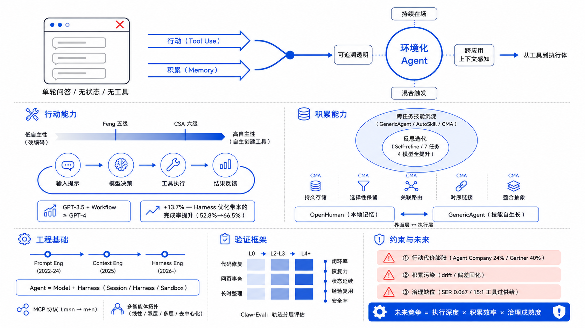

# 聊天框之外：Agentic AI 的下一种形态

## 摘要

从网页端对话到代码代理、浏览器代理，再到具备长期记忆和多端入口的开放 Agent，AI 产品的形态变化背后有一个深层驱动力：Agent 同时获得了**行动**与**积累**两种以往系统不具备的能力。行动使其进入需要执行的业务流程，积累使其在任务中保留状态、沉淀可复用技能并持续改进。本文以工具使用和记忆机制为分析主线，追踪这一演变如何推动 Agent 从聊天框中走出，并朝向一种"环境化"的形态发展——本文将其界定为具备持续在场、跨应用上下文感知、混合触发与可追溯透明性四个特征的任务执行层。

分析过程中，本文整合了 Anthropic Managed Agents 的 harness 架构、CMA 长程记忆模型、AutoSkill 技能自演化、AgentWarden 能力治理等近期的工业界与学术界工作，以及 LangChain Terminal Bench 对照实验中 harness 优化带来 13.7 个百分点增益等定量证据，从中提取出 harness engineering 的范式迁移、MCP 协议标准化与多智能体协作拓扑三条共同技术线索。文章进一步提出了一套三类系统（L0 / L2–L3 / L4+）× 三类任务 × 五个维度的对比验证框架，用以检验形态演变是否属于真实的能力跃迁。

尽管如此，Agent 进入真实环境后也面临行动代价膨胀、积累机制污染与 capability overprovisioning 等治理挑战。本文认为，Agentic AI 的未来竞争已从回答质量转向执行深度、积累效率与治理成熟度的乘积——这决定了"走出聊天框"到底能走多远。

**关键词**：Agentic AI；Tool Use；Memory；Harness Engineering；Ambient Agent；Governance

---

## 一、窗口时代的终点

大语言模型最初进入公众视野的时候，最常见的交互形态就是网页聊天。它的好处确实很直接：几乎没有交互门槛，表达方式自然，几乎所有需要人与机器沟通的地方都能用上。但聊天框这种形态也天然地给 AI 的工作方式设了限：用户提请求，模型给回答，任务在一轮或多轮对话中结束。问一个问题、得到一个答案——这个模式在问答场景里很合适，放到真实工作任务中就不太够用了。

真实的任务通常不是"一问一答"就能收工的。修一个 bug，你得去读日志、改源码、跑测试，再反复验证；整理资料，需要检索、归类、去重，然后更新；处理网页上的事务，免不了一连串的点击、跳转、填写、检查甚至回退。聊天框把 AI 限制在语言交互的层面，而实际工作需要的是它能进入行为层面去操作。

从工业界的动向来看，这种"走出聊天框"的趋势已经不只是产品层面的探索了。OpenAI 的 [Codex](https://openai.com/codex/)、Anthropic 的 [Claude Code](https://www.anthropic.com/product/claude-code) 和 [computer use](https://docs.anthropic.com/en/docs/agents-and-tools/tool-use/computer-use-tool) 工具在闭源侧推进，开源社区里 [OpenHands](https://github.com/OpenHands/OpenHands)（76k+ GitHub stars）、[browser-use](https://github.com/browser-use/browser-use)、[OpenHuman](https://github.com/tinyhumansai/openhuman) 和 [GenericAgent](https://github.com/lsdefine/GenericAgent) 也在各自的路径上探索。Irving Wladawsky-Berger 在一篇[讨论 Agentic AI 长期演进的博客](https://blog.irvingwb.com/blog/2025/08/the-long-term-evolution-of-agentic-ai.html)中引用 McKinsey 的判断，把这种变化概括为"从基于知识的 gen-AI 工具——比如回答问题、生成内容的聊天机器人——到使用基础模型在数字世界中执行复杂多步工作流的 gen AI 代理"。用笔者自己的话来理解就是：聊天框只是 AI 的第一种"存在方式"，而不是它唯一的、最终的存在方式。

笔者认为"聊天框之外"并不是一句产品宣传语，而是 Agentic AI 发展逻辑上的一个自然结果：**当 AI 开始承担真实任务，它迟早要走出单轮对话的窗口。** 这些项目共同传递出的一个信号是——Agent 正在从那个"等待提问的窗口"里走出来，变成"持续参与任务的系统"。

---

## 二、行动的开始

Agent 能走出聊天框，第一步靠的不是"更会说"，而是"开始做事"。

从自主性高低来看，这种"做事"的能力有明显的层次。吴恩达在 [Agentic AI 课程](https://www.deeplearning.ai/short-courses/agentic-ai/)中把 Agent 的自主性放在了一个光谱上讨论：**低自主性**的一端，所有步骤都是预先写定的，工具调用也是硬编码的，LLM 能发挥能动性的地方基本上仅限于生成文本本身；**高自主性**的一端，Agent 则可以对大量环节做出自主决策，动态调整执行步骤的先后顺序，甚至能在运行时创建新的、可执行的工具。用一种不那么严谨但比较好理解的说法，前者像一个"听话但不太会动脑子的助手"，后者更像一个"聪明而且有点责任心的实习生"。

与这个光谱平行的，是学术界和工业界各自提出的分级框架。华盛顿大学 Feng 等人的[工作论文](https://arxiv.org/html/2506.12469v1)从用户角色的角度定义了五级自主性——Operator、Collaborator、Consultant、Approver、Observer——把"自主性"当作一个独立于能力的设计决策来对待。[Cloud Security Alliance](https://cloudsecurityalliance.org/blog/2026/01/28/levels-of-autonomy) 则在 2026 年初发布了一套六级分类，附带 Capability-Control Matrix，从安全治理的角度给出了每级应该匹配的控制措施。笔者的一个观察是：这些框架虽然在分级粒度上有些差异，但底层逻辑是共通的——自主性越高，需要配套的控制机制就越精细。这跟自动驾驶的 SAE 分级思路很相似。

落到技术实现上，行动能力的核心就是工具使用与环境交互。工具使用的底层机制可以理解为一个完整闭环：**输入提示 → 模型决策 → 工具执行 → 结果反馈 → 最终输出**。这里有一个细节笔者觉得值得关注：模型并不是对什么问题都盲调工具。比如当你问"现在几点"，它知道自己需要调用 `get_current_time()` 来获取实时数据；但如果问的是"绿茶含多少咖啡因"，它完全可以直接依赖内部知识来回答。课程中也特别强调了这一点：**模型能够区分哪些信息是静态的（可以内化），哪些是动态的（必须外求）**。这种判断力本身，就是 Agent"行动能力"不同于机械调用的地方。

有一个实验数据值得在这里提一下：在 HumanEval 基准测试上，GPT-3.5 加上 agentic workflow 之后，可以达到甚至超过 GPT-4 直接生成的水平。这说明通过工作流设计带来的提升，有时候比单纯升级模型版本还要大。最近 LangChain 在 Terminal Bench 2.0 上的对照实验给出了一个更具体的数字：在模型不变的情况下，仅优化 harness 配置，任务完成率就从 52.8% 提升到了 66.5%——13.7 个百分点的增益完全归因于 harness 设计。这个结果让笔者意识到，之前可能低估了"系统层"对 Agent 能力的贡献：很多时候我们以为是模型不够聪明，实际上可能是模型周围的脚手架搭得不够好。

从这个角度看，笔者觉得聊天框之所以变得不够用，不是因为它不再流行，而是因为它根本承载不了这种执行闭环。一个被限制在对话窗口内的系统，很难自然地处理那种持续的、带外部反馈的、涉及多步骤的任务；AI 一旦被拉进真实任务的流程里，界面就必然会朝外扩展，形态也就必然会跟着变。

---

## 三、积累的诞生

如果说行动能力回答了"Agent 为什么能走出聊天框"，那么积累能力回答的就是"Agent 为什么不会再回到聊天框"。

传统的聊天系统还有一个根本的局限：每次对话几乎是"从零开始"。即使现在上下文窗口已经做得很长，它提供的仍然更像是一种临时的、一次性的记忆，而不是一套真正能持续成长的机制。但真实任务偏偏需要另一种能力——能记住之前做过的步骤，能保留中间的进展状态，能把可复用的经验沉淀下来，下次碰到相似任务的时候可以直接调用。

笔者理解的"积累"，可以拆成两个层面来看。

**第一个层面是单次任务内的迭代改进。** 吴恩达在课程里强调的"反思"（Reflection）模式——生成初稿、找出问题、改进版本——可以看作积累的一种雏形：Agent 开始能从自己的输出中学习，而不是一次性生成就结束。课程中引用的论文《[Self-refine](https://arxiv.org/abs/2303.17651)》给出了一个比较有说服力的实验数据：在 7 类任务、4 个模型（GPT-3.5、ChatGPT、GPT-4、Claude）的测试中，加入反思步骤之后，每一个模型在每一种任务上的表现都有提升——没有出现例外。即使是最强的 GPT-4，加了反思之后还能更进一步。笔者觉得这或许说明了一件事：反思不是在补救"模型不够好"，而是在弥补"一次性生成的信息不充分"这个结构性问题。

**第二个层面是跨任务的经验沉淀**，这也是笔者认为真正意义上的积累。在这个方向上，最近出现了一些比较有意思的工作。

GenericAgent 把自己的核心概括成 `Layered Memory × Minimal Toolset × Autonomous Execution Loop`，并且很明确地说"不要预装技能，而是让技能从任务中生长"。它的思路大致是：每完成一项新任务，就把这次任务的执行路径结晶成一个可复用的 skill，时间长了，用户就会拥有一个属于自己的 skill tree。这中间最让我觉得有意思的，不是它支持了多少个工具，而是它做到了"做过一次" → "下次更会做"。

与这个思路高度呼应的是一项名为 [AutoSkill](https://arxiv.org/abs/2603.01145v2) 的研究工作。AutoSkill 被设计成一个 model-agnostic 的插件层，它从对话和交互轨迹中自动抽象出 skill，支持持续的自演化，并在未来的请求中动态注入相关的 skill——整个过程不需要重新训练底层的模型。论文里有一句话笔者印象很深："AutoSkill turns ephemeral interaction experience into explicit, reusable, and composable capabilities."（把短暂交互经验转化为显式的、可复用的、可组合的能力。）这与 GenericAgent"让技能从任务中生长"的理念几乎完全一致，只不过前者偏系统实现而后者偏产品哲学。

与此同时，Joe Logan 在其[关于长程记忆架构的论文](https://arxiv.org/html/2601.09913)中对主流 RAG 方案做了一次比较彻底的审视。他的核心论点很直接：RAG 把 memory 当成了一个 stateless 的查找表——信息永久存在、检索是只读的、时间连续性完全缺失。他提出的 Continuum Memory Architecture（CMA）要求 memory 系统具备五个特性：persistent storage（持久存储）、selective retention（选择性保留）、associative routing（关联路由）、temporal chaining（时序链接）和 consolidation（整合抽象）。虽然这篇论文没有给出具体的实现细节，但它的价值在于定义了"什么才算真正持久的 agent memory"——不是把历史对话存入向量库就算完事，而是需要一套有生命周期、有遗忘机制、有整合能力的记忆架构。

OpenHuman 从另一个侧面展示了同样的方向。它强调的是本地记忆、Memory Tree、类似 Obsidian 的知识库结构、自动拉取第三方服务数据以及后台持续运行。它的意图不是把 AI 做成一个用完即走的小助手，而是让 Agent 在用户的日常使用环境里不断积累关于任务、习惯和需求的上下文。

综合来看，笔者觉得 Agent 之间的真正分水岭，或许不单是会不会调用工具，而是会不会积累。**当 AI 同时具备行动能力与积累能力的时候，它就从一次性使用的工具，转向了一个可以持续成长的执行体。** 这大概也是为什么在目前的 Agent 讨论中，`memory`、`state`、`skill` 这些词出现的频率越来越高：它们不是锦上添花的附属能力，而是新形态之所以能成立的基础条件。

---

## 四、环境中的 Agent

当行动能力与积累能力同时出现，Agent 的下一种形态就不再只是"把聊天框做得更大"了，而是开始呈现出一种"环境化"的特征。

这里说的"环境化"，并不一定要理解成一个全新的操作系统；更准确地说，它指的是 Agent 从一个"需要被用户主动唤起的工具"，变成一种"持续在场的层"——不那么显眼，但始终在那里。

具体而言，环境化 Agent 应具备以下特征：（1）**持续在场**——不依赖用户主动唤起，可在后台持续运行；（2）**跨应用上下文感知**——能够读取和协调多个应用之间的状态；（3）**混合触发**——既响应用户指令，也能根据事件或时间条件自主发起任务；（4）**可追溯的透明性**——所有自主行为有完整的审计日志，用户随时可查。一个反例或许能把边界画得更清楚：嵌在 IDE 侧边栏的聊天插件，离开 IDE 就丢失上下文——它是工具，不是环境。环境化的本质不在于界面的隐身，而在于它从"回答"转向了"在场"。

### 4.1 Harness Engineering：工程重心的下移

CMU、Yale 等机构在 2026 年的一篇[综述](https://arxiv.org/html/2604.11548v1)里提出了一个有意思的观察：Agent 的工程范式已经经历了三个阶段——Prompt Engineering（2022–2024）、Context Engineering（2025）、Harness Engineering（2026–）。这个迁移说明社区正在逐渐把 Agent 当成一个独立的系统层来对待，而不只是模型的附属品。

什么是 Harness？简而言之：`Agent = Model + Harness`——Model 负责推理和语言生成，Harness 掌管除此之外的一切：event loop、安全沙箱、混合记忆、MCP 客户端、skill 注册表。[One Man Crew 博客](https://www.onemancrew.dev/blog/death-of-frameworks-rise-of-the-harness)有一句话概括得精准："frameworks ask you to import them; harnesses ask you to run them."这类似于 Web 开发从手写 HTTP 服务器到使用容器化运行时的转变——Agent 基础设施正在经历同样的拐点。

Anthropic 的 [Managed Agents](https://www.anthropic.com/engineering/managed-agents)实践佐证了这一方向：他们把 Agent 拆成三个可独立替换的组件——Session（不可追加的事件日志）、Harness（调用循环）和 Sandbox（隔离执行环境），解耦之后 harness 不再与容器绑定，sandbox 成为可替换的"cattle"而非"pet"。这个架构将 p50 的 time-to-first-token（TTFT）降低了约 60%，p95 降低了超过 90%。

在自动化方向上，Sylph.AI 的["The Last Harness You'll Ever Build"](https://arxiv.org/html/2604.21003)提出了 Harness Evolution Loop——Worker Agent 执行任务，Evaluator Agent 诊断失败并打分，Evolution Agent 根据历史修改 harness——并进一步升级为 Meta-Evolution Loop，将"如何进化 harness"本身的优化也纳入 harness 管理。如果 harness engineering 能被自动化，那么 Agent 的运行环境本身也在自我进化。

### 4.2 协议标准化与多智能体协作

环境化趋势往前走，离不开协议标准化的支撑。Anthropic 提出的 MCP（Model Context Protocol）的价值在于解决了一个典型的集成效率问题：假设有 m 个应用需要分别集成 n 个工具，传统做法需要 m×n 次对接；换成 MCP 之后只需要 n 个 MCP 服务器，让 m 个应用去连接，工作量降为 m+n。在 MCP 社区发布的 [2026 年路线图](https://blog.modelcontextprotocol.io/posts/2026-mcp-roadmap/)中，四个优先方向被明确列出：transport 的横向扩展、agent 间通信（Tasks 原语的 retry 和 expiry）、治理机制成熟化（contributor ladder 和委托审查）、以及企业级就绪度（审计、SSO、gateway）。从基础设施的角度看，Agent 生态的骨架正在形成。

多智能体协作也是环境化的一个重要表现。多个 Agent 根据通信模式可以组织为线性的（流水线式传递）、双层的（中心协调节点派发任务）、多层的（子 Agent 递归分层）或去中心化的（Agent 之间点对点协商）。不同拓扑适用不同场景：线性适合固定流程，双层适合资源调度，去中心化适合动态任务分配。多 Agent 架构还有一个很实际的好处：每个 Agent 只关注自己负责的那部分上下文，最后由汇总 Agent 整合结果，从而有效突破单 Agent 的上下文长度限制。

如果要挑两个项目来类比说明这种趋势，OpenHuman 可以看作环境化趋势在"界面层"的体现：UI-first、后台持续思考、多平台集成、本地记忆。GenericAgent 则更像是同一趋势在"执行层"的体现：少量原子化的工具、长程记忆、自我演化的技能树。两者风格看上去差异很大，但背后指向的是同一个变化——Agent 已经不再只是聊天的入口，而是开始成为连接用户、工具、数据和任务流程的一层中介。

通过上面的分析，笔者认为：**Agentic AI 的下一种形态，不是更强的助手，而是更环境化的、能持续成长的执行体。** 它的入口可以是聊天界面、桌面 UI、命令行、浏览器插件，但这些都不决定它的本质。真正的变化发生在存在方式上——它越来越像一层持续在线、持续积累、持续参与执行的环境层。

---

## 五、如何检验这场演变：一个验证思路

光靠趋势判断是不够的，还需要一条能落地检验的分析路径。笔者在这里尝试提出一套对比验证的思路，用来大致判断"Agent 正在走出聊天框"这个说法到底靠不靠谱。

实验的基本思路是设置三类系统做对比：

1. **纯聊天系统（L0）**：只提供问答功能，不调用任何外部工具，也不保留长期状态；
2. **执行型 Agent（L2–L3）**：可以调用工具、操作终端或浏览器，但没有持续的长期记忆，也没有 skill 沉淀机制；
3. **成长型 Agent（L4+）**：既能调用工具，又能保留任务状态、沉淀技能，并且在后续任务中复用之前积累的经验。

这个分类大致对应了 Cloud Security Alliance 的六级自主性框架：L0 是完全受监督的、L2–L3 是半自主但有审批关卡、L4+ 是任务范围内的自主。也跟华盛顿大学那篇工作论文中 Collaborator–Consultant 的中间地带基本吻合。

再选三类比较有代表性的任务：

- **代码修复**：读日志 → 定位问题 → 修改文件 → 运行测试 → 根据结果继续修改；
- **网页事务**：搜索 → 点击 → 填写表单 → 页面跳转 → 核验结果；
- **长时整理**：跨多轮对话收集资料、归类归档，并且持续更新已有信息。

从五个维度来比较：

- **任务闭环成功率**：能不能真正把事情做完；
- **跨步骤恢复能力**：某一步出错了，是直接卡死，还是能尝试重试或换条路走；
- **状态延续率**：能不能正确地承接之前留下来的中间结果；
- **经验复用率**：之前沉淀下来的 skill，能不能在下次同类任务里用上；
- **安全违规率**：有没有出现越权操作、误删文件、错误执行等安全方面的问题。

验证时还需要考虑评估本身的可信度。最近出现的 [Claw-Eval](https://arxiv.org/pdf/2604.06132) 评估框架指出很多现有的 agent benchmark 存在 trajectory-opaque grading 的问题——只看最后结果对不对，不看中间过程是否合理——以及安全性评估不足的缺陷。所以在这个实验设计中，除了看"是否完成任务"，还需要对执行轨迹做分层评估：工具调用是否恰当、中间状态是否正确、错误恢复路径是否合理。

如果实验结果显示第三类系统在长时任务和复杂任务上的表现确实好过前两类，而且这种差距不是随机的，那么对"Agent 走出聊天框不是界面修辞而是能力演变"这个判断，就有了比定性描述更实在一些的依据。当然笔者也清楚，这套实验设计还是比较粗糙的——"成长型 Agent"目前本身就没有一个公认的标准实现，三类系统之间的边界在实际搭建时也会有很多灰色地带。但作为一个验证方向的框架，至少能帮我们把讨论从"看起来像是这样"拉到"有没有数据来说明是这样"的层面。

---

## 六、成熟之前的问题

话说回来，走出聊天框并不意味着已经成熟。从另一个角度看，Agent 进入真实环境之后，反而可能暴露出更多问题。

### 6.1 行动能力越强，犯错代价越高

第一个比较明显的问题是，行动能力越强，犯错的代价就越高。生成一段错误文本，通常只是信息有误；但如果误点了网页按钮、误执行了脚本、误操作了账户，产生的影响就很难挽回了。Anthropic 的 computer use 实验和 [OSWorld](https://arxiv.org/abs/2404.07972) 这类基准测试的结果都提醒我们，在真实的桌面环境中，Agent 的稳定性距离"可以放心放手"还有不小的距离。

CMU 研究者在 2025 年做了一个名为["Agent Company"](https://www.cs.cmu.edu/news/2025/agent-company)的实验：让 10 个不同的 agent 去运营一个软件公司。结果是表现最好的 agent 也只完成了 24% 的指派任务。Gartner 则预测到 2027 年将有超过 40% 的 agentic 项目被取消。这些数字虽然不能说明 Agent 方向是错的，但至少提示了一个事实：在受控环境中跑 benchmark 的表现，和在生产环境中处理真实多变任务的表现之间，还有一道不小的鸿沟。

### 6.2 积累能力的"污染"风险

第二个问题可能更隐蔽：积累能力在带来收益的同时，也可能引入"污染"。记忆能沉淀经验，也能固化偏差；skill 能复用成功路径，但也可能在不知不觉中重复放大旧有的错误。笔者自己的一个观察是，如果一套成长系统既没有更新机制、也没有遗忘机制、同时缺乏有效的纠错手段，那么跑得越久，累积下来的可能就不是经验，而是一堆很难清理的错误惯性。

CMA 论文在讨论部分也提到了类似的问题：memory 系统的 drift（漂移）——随着时间推移，agent 对"什么是正确的行为"的内部表征可能逐渐偏离用户的原始意图。CMA 提出的方案是通过 consolidation 机制（将 episodic memory 逐步整合为 semantic knowledge）来对抗 drift，但这本身又会引入新的 interpretability 问题——consolidation 之后的信息更难被直接追溯和审计。

这其实涉及到一个更底层的系统约束——能力与控制之间的权衡：更大的工具菜单、持久记忆和宽松的权限边界确实能扩展 Agent 的能力范围，但同时也在放大出错的爆炸半径。

### 6.3 从技术问题到治理问题

第三个问题是，环境化趋势会把原本的技术问题逐渐转化为治理问题。Ben-Gurion 大学的一项[研究](https://arxiv.org/html/2604.11839v2)提出了一个比较精确的概念来描述这个问题：capability overprovisioning。他们在一份实际部署的 OpenClaw 实例上测量发现，一个摘要任务被暴露了 15 个工具（包括 shell 执行、子 agent 生成、凭证访问），而实际只用到了 1 个——15 倍的过度供给。他们定义的 Skill Economy Ratio (SER) 只有 0.067。

他们的解决方案 AgentWarden 采用了三层架构：Capability Governor 按任务类型动态限制 agent 可见的工具集，RL Learning Policy 通过 PPO 学习每种任务的最小工具集，Safety Router 在每个工具调用执行前进行拦截。在 N=500 的评估中，exec 和 sessions_spawn 两个高危工具被 100% 拦截，92% 的对抗性任务被成功中和。训练在 RTX 3090 上不到 5 分钟即可完成。

这项研究让笔者意识到，Agent 的下一种形态能不能真正站稳，不光是看模型能力够不够强，也要看治理机制能不能同步跟上。一个常驻的、跨应用的、持续在线执行的 Agent，天然就会触及到权限边界的划定、责任归属的判断、操作是否可追溯、关键动作是否可撤销。Agent 的治理问题不像传统软件安全那样有一个静态的攻击面可以防御——它的攻击面是动态的、随任务类型变化的，所以治理也需要是动态的、自适应的。

综合这些考虑，笔者并不倾向于对 Agentic AI 的未来做单向的乐观判断。更接近实际的描述可能是：**Agent 走出聊天框是一条正在发生的真实趋势，但它能不能稳定地、可持续地演化为下一种形态，仍然取决于技术能力与治理能力这两个轮子能不能同步转动。**

---

## 七、聊天框之外

回到一开始的那个问题：Agentic AI 为什么会走出聊天框？

经过上面的分析，笔者给出的理解是：这不是一次单纯的界面升级，而是因为 AI 同时获得了"行动"和"积累"这两种它过去所缺乏的能力。行动让它能够进入真实的任务流程，积累让它能够在这个过程中持续成长。而在工程层面，harness engineering 正在取代 prompt engineering 成为新的技术重心——Agent 不再是模型的附属品，而是一个以模型为引擎、以 harness 为底盘的独立系统层。

近期的工业实践给出了初步的验证信号：LangChain 的实验证明了 harness 改进（13.7 个百分点）可以超越模型升级的单次收益；Anthropic 的 Managed Agents 证明了通过 brain/hands/session 解耦可以将 p95 时延降低 90%；AgentWarden 证明了动态能力治理可以在不牺牲功能的前提下将危险工具暴露降到零。这些结果当然不是最终答案，但它们共同勾勒出了一个方向：**Agentic AI 的下一种形态，会越来越表现为环境中那个能够持续成长的执行体。**

它未必会扔掉聊天界面，但它的定义不会再被聊天界面所束缚。它的真正边界，也不是由窗口的大小来决定的，而是由行动能力的广度、记忆能力的深度、技能沉淀的效率，以及治理机制能否兜底来共同决定的。

换个更直白的说法：未来 Agent 之间的竞争，比的已经不只是"谁回答得更好"，而是"谁更能做事、谁更能积累、谁更能在真实环境里持续地成长下去"。

